```c
#include <stdio.h>

#define l int
#define lo main
#define lol (
#define loll )
#define lollo {
#define lollol }
#define lolloll printf
#define lollollo ;
#define lollollol return
#define lollolloll "Hello, World!"
#define lollollollo 0

l lo lol loll lollo
    lolloll lol lollolloll loll lollollo
    lollollol lollollollo lollollo
lollol
```


<br>
<br><br>

### 👋 Hi!~~Bye!~~

-----

WHAT THE HELL ARE YOU DOING ON MY PROFILE???<br>
않이 지금 제 프로필에서 뭐하냐구여!<br>
<!---->
<br><br>

## Learning Languages

- Java
- C/C++
- IA-32 Intel syntax Assembly
- Javascript(*Mostly Node.JS*)
- PHP
- ~~HTML~~

Fun Fact : HTML is ~~NOT~~ a programming Language

## Other Stuffs

- Blender
- SolidWorks 2024
- PhotoShop


## Projects

- ACHOO BOT(Kakaotalk)
- [ACHOO DISCORD BOT](https://discord.com/oauth2/authorize?client_id=713656780374147102&permissions=8&scope=bot)
- ~~Sleeping~~
<!--
**williameom5678/williameom5678** is a ✨ _special_ ✨ repository because its `README.md` (this file) appears on your GitHub profile.

Here are some ideas to get you started:

- 🔭 I’m currently working on ...
- 🌱 I’m currently learning ...
- 👯 I’m looking to collaborate on ...
- 🤔 I’m looking for help with ...
- 💬 Ask me about ...
- 📫 How to reach me: ...
- 😄 Pronouns: ...
- ⚡ Fun fact: ...
-->
